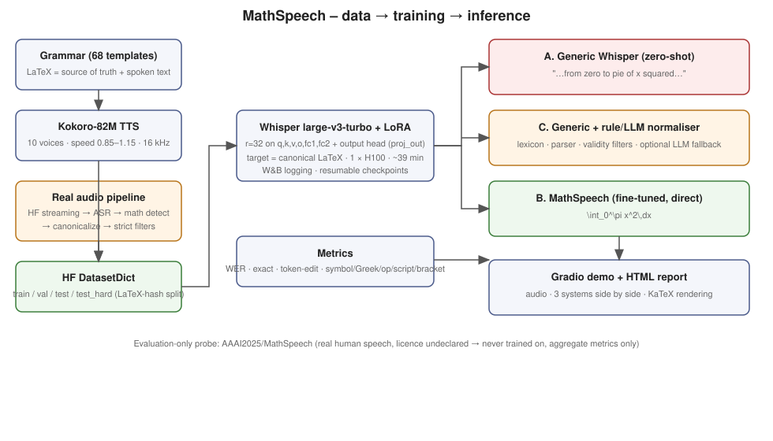

# MathSpeech — speech recognition that writes mathematical notation

> General-purpose speech recognition is optimized for natural language. Mathematical speech is different: the acoustic
> realization of a symbol, its semantic role, and its written representation are tightly coupled.
>
> MathSpeech fine-tunes an open-source speech model on mathematical and scientific speech so that spoken mathematical
> expressions are transcribed directly into canonical notation.



**Model weights:** [`Pd172944/mathspeech-qwen3-asr-1.7b-lora`](https://huggingface.co/Pd172944/mathspeech-qwen3-asr-1.7b-lora) on the Hugging Face Hub (LoRA adapter + model card + eval metrics; currently private).

**v2 (this version):** model upgraded from Whisper to **Qwen3-ASR-1.7B** (released June 2026, Apache-2.0, Transformers-native), a **compositional grammar** + extra voices/augmentation for generalization, and an **on-the-fly LaTeX → Unicode text renderer** so output looks right even without a TeX engine.

| Spoken | Generic ASR (Qwen3-ASR zero-shot) | **MathSpeech** (LaTeX) | **MathSpeech** (plain text, rendered on the fly) |
|---|---|---|---|
| "the limit as h goes to zero of the fraction f of x plus h minus f of x over h end fraction equals f prime of x" | `The limit as h goes to zero of the fraction f of x plus h …` | `\lim_{h \to 0} \frac{f(x + h) - f(x)}{h} = f'(x)` | `lim_(h→0) (f(x + h) − f(x))/h = f′(x)` |
| "the two norm of bold x squared equals the sum from i equals one to n of x sub i squared" | `The two norm of bold x squared equals the sum …` | `\|\mathbf{x}\|_2^2 = \sum_{i=1}^n x_i^2` | `‖𝐱‖₂² = ∑ᵢ₌₁ⁿ xᵢ²` |
| "C H four plus two O two yields C O two plus two H two O" | `CH₄ + 2O₂ yields CO₂ + 2H₂O.` | `\mathrm{CH_4} + 2 \mathrm{O_2} \to \mathrm{CO_2} + 2 \mathrm{H_2O}` | `CH₄ + 2 O₂ → CO₂ + 2 H₂O` |
| "theta is updated to theta minus alpha nabla sub theta J of theta" | `Theta is updated to theta minus alpha nabla sub theta …` | `\theta \leftarrow \theta - \alpha \nabla_\theta J(\theta)` | `θ ← θ − α∇_θJ(θ)` |
| "the closed integral of vector B dot d vector l equals mu sub zero I" | `The closed integral of vector B dot d vector l …` | `\oint \vec{B} \cdot d\vec{l} = \mu_0 I` | `∮ B⃗ · dl⃗ = μ₀ I` |

All five are from the hand-written **OOD test set** (never trained on). More, with audio players: `artifacts/evaluation/report.html`; 24 curated pairs in `artifacts/demo/examples.json`.

## What was built

* **Model:** `Qwen/Qwen3-ASR-1.7B-hf` (Qwen3-Omni audio encoder + Qwen3 LLM decoder) + LoRA r=32 on the LLM attention/MLP, audio-encoder attention and projector (41 M trainable of 2.08 B). Fallback: `Qwen3-ASR-0.6B-hf`; previous-generation baseline: Whisper large-v3-turbo.
  *Why:* recent (June 2026), Apache-2.0, fully Transformers/PEFT-native, an LLM decoder whose tokenizer and prior already know LaTeX (Whisper's BPE even *suppresses* `\ { } ^ _` by default — v1 had to work around that), and ~25 min to fine-tune on one H100. Other recent candidates considered: Granite-Speech-4.1-2B, Cohere-Transcribe-03-2026 (gated), Voxtral, Parakeet/Canary (NeMo toolchain), MOSS-Transcribe.
* **Data (27,243 train clips, 35.9 h; 442 val; four test sets):**
  * *68 hand-written templates* across 10 domains (algebra, calculus, linear algebra, probability, set theory, analysis, ML, physics, chemistry, CS) — 15.6 k clips;
  * *compositional random trees* (`src/data/compose.py`): nested powers/fractions/roots/functions/big operators/matrices/probability, ML and physics notation with unambiguous spoken forms ("the fraction … over … end fraction", "the quantity … end quantity") — 13 k clips;
  * *Kokoro-82M TTS*, 14 train voices + 2 held-out voices, speed 0.85–1.15, ±7 % pitch/tempo shift, and on-the-fly gain/noise augmentation during training;
  * LaTeX is the source of truth; splits are by hash of the canonical LaTeX and **validated leak-free** (`scripts/validate_dataset.py`).
* **Four test sets that measure different things:** `test` (unseen expressions, known template families) · `test_comp` (unseen random compositions) · `test_hard` (9 template families never trained on, unseen voices) · `test_ood` (**64 hand-written expressions with natural phrasing, written before the compositional grammar, unseen voices; 3 near-duplicates of training items were found by the validator and replaced**).
* **Normalization layer** (`src/normalization/`): lexicon + structured parser + context gating (`"the pie is on the table"` stays text; `"pi is approximately three point fourteen"` → `\pi \approx 3.14`) + validity filters + optional LLM fallback. Used as baseline C.
* **LaTeX → text on the fly** (`src/rendering/latex_to_text.py`): Greek, Unicode super/subscripts (`x²`, `θₜ₊₁`, `∑ᵢ₌₁ⁿ`), fractions (`½`, `∂f/∂x`, `(x + 1)/(x − 1)`), roots, accents (`x̂`, `x̄`, `B⃗`), blackboard/bold/script fonts (`ℝⁿ`, `𝐱`, `𝒩`), matrices, big operators, relations/arrows. No TeX engine; unknown commands are kept verbatim. It is used by the demo (separate "Plain text" output), `scripts/transcribe.py`, the report and `MathTranscriber`. All 28,716 corpus targets render with no leftover LaTeX commands (checked; also `tests/test_rendering.py`).
* **Real audio pipeline** (`scripts/build_real_corpus.py`): HF streaming → ASR → math detection → canonicalize → deterministic filters, with provenance. **Yielded 0 accepted clips this run** (People's Speech is almost all civic audio; 1,500 prefiltered clips all rejected, correctly). `AAAI2025/MathSpeech` (real human math speech, licence undeclared) is used **only as an evaluation probe**.
* **Tracking:** W&B `prithvidixit05-/voiceTrain` (`qwen3asr-canonical-v1` training; `eval-Qwen3-ASR-1.7B-hf` summary metrics).

## Results (single H100, GPU 0)

Systems — **A** generic Qwen3-ASR (raw) · **C** A + rule normalizer · **B** MathSpeech (direct LaTeX) · *Whisper v1* = previous version (Whisper-large-v3-turbo + LoRA, 15.6 k clips).

| split (n) | metric | A generic | C generic+rules | **B MathSpeech** | Whisper v1 |
|---|---|---|---|---|---|
| **test** (433) unseen expressions | exact match | 0.000 | 0.480 | **0.975** | 0.912 |
| | LaTeX token edit ↓ | 2.816 | 0.246 | **0.003** | 0.012 |
| **test_comp** (416) unseen compositions | exact match | 0.000 | 0.219 | **0.940** | – |
| | token edit ↓ | 2.901 | 0.345 | **0.004** | – |
| **test_ood** (128) hand-written, natural phrasing | exact match | 0.000 | 0.406 | **0.797** | – |
| | token edit ↓ | 2.968 | 0.420 | **0.044** | – |
| **test_hard** (54) unseen templates | exact match | 0.000 | **0.556** | 0.481 | 0.111 |
| | token edit ↓ | 2.652 | 0.191 | 0.202 | 0.368 |
| **real human speech** (1,101, eval-only) | token edit ↓ | 2.166 | 0.527 | **0.264** | 0.357 |
| | exact (loose labels) | 0.000 | 0.084 | **0.305** | 0.172 |

Diagnostic accuracies for B: Greek 0.99–1.00, operators 0.99–1.00, brackets 0.98–1.00, sub/superscripts 0.96–0.99, symbols 0.98–1.00 on test/test_comp/test_ood (full tables in `artifacts/report.md`). Ordinary WER of the generic model against the spoken words is 0.055–0.14 (mostly digits-vs-words and capitalization).

**Training:** LoRA r=32/α=64 · lr 1e-4 cosine, 100 warm-up · 3 epochs · batch 16×2 accumulation · bf16 autocast · augmentation p=0.5 · seed 1234 · **2,550 steps, 25.5 min on one NVIDIA H100 80GB**, best validation loss 0.0122.

### What improved generalization (v1 → v2)
| | test | test_hard | real speech (token edit) |
|---|---|---|---|
| v1: Whisper + LoRA, templates only | 0.912 | 0.111 | 0.357 |
| v2: Qwen3-ASR + LoRA, + compositional data, more voices, augmentation | **0.975** | **0.481** | **0.264** |

Unseen-template accuracy rose 4×. I did not run a clean model-only vs data-only ablation (the Whisper model has no way to use the compositional data as well), so the credit is shared between the LLM-decoder prior and the new data.

### Honest reading
1. **Large, consistent gain over generic ASR**, including on hand-written OOD speech (0.797 vs 0.406 for generic+rules) and on real human recordings.
2. **Still not fully compositional.** On entire template families never seen in training, the rule-based normalizer is still slightly better by exact match (0.556 vs 0.481), though MathSpeech has perfect Greek/script/bracket accuracy there. Residual failures concentrate in multi-symbol constructs (see the report's error analysis).
3. **Many OOD "errors" are unobservable or conventions**, not acoustic mistakes: `bold A` vs `bold a` and `E[X]` vs `E[x]` sound identical; `\det(A) \cdot \det(B)` vs juxtaposition; `\dim \ker(A)` vs `\dim(\ker(A))`. Exact match counts them as errors; ML and linear algebra are the weakest domains (n=12–16 each, so per-domain numbers are anecdotal).
4. **C is not independent of the data generator**: the rule normalizer was written against the same family of phrasings, so it is favoured on synthetic data. The real-speech probe (labels in a different style, so absolute numbers are low) is the fairer comparison.
5. The LLM-written-paraphrase idea from the spec was **not run**: the supplied OpenRouter key returned HTTP 402 (no credit). The code path exists (`src/normalization/llm_normalizer.py`) but is off.

## Use

```bash
python app/app.py                       # Gradio demo: upload/record → generic ASR, MathSpeech LaTeX, plain-text rendering, typeset equation
python scripts/transcribe.py a.wav      # CLI: generic / LaTeX / Unicode text
python - <<'PY'
from src.rendering.latex_to_text import latex_to_text
print(latex_to_text(r"\int_0^\pi x^2\,dx"))        # ∫₀^π x² dx
PY
```

## Reproduce
```bash
git clone https://github.com/Pd172944/voice-math.git && cd voice-math
cp .env.example .env            # optional: HF_TOKEN, WANDB_API_KEY, OPENROUTER_API_KEY
bash scripts/run_all.sh         # everything; idempotent, resumes after failure (SKIP_REAL=1 skips the real-audio stage)
make test
python scripts/show_dataset.py -n 8    # inspect random examples
```
Single-GPU by design (`CUDA_VISIBLE_DEVICES` defaults to 0). Paths come from `DATA_DIR`, `OUTPUT_DIR`, `MODEL_ID`, `HF_HOME`. Wall time on one H100: TTS ≈ 12 min, training ≈ 26 min, evaluation ≈ 5 min. Set `MODEL_ID=openai/whisper-large-v3-turbo` to run the Whisper backend (uses `whisper_target_modules`; decode without symbol suppression is handled automatically for adapters).

## Layout
`src/data/{grammar,compose,ood}.py` expression generators · `src/normalization/` rule normalizer · `src/rendering/latex_to_text.py` · `src/evaluation/metrics.py` · `src/inference/{asr,transcriber}.py` ·
`scripts/` discover → generate_math → generate_spoken → generate_tts → build_real_corpus → build_dataset → validate_dataset → train → evaluate → eval_external → generate_demo → generate_report · `app/app.py` · `configs/` · `tests/` · cards: `docs/MODEL_CARD.md`, `docs/DATASET_CARD.md`.

## Limitations
* Training audio is **synthetic TTS** (clean read speech, no accents/disfluency); real speech is only probed. The probe's labels follow a different LaTeX style, so absolute scores there are conservative.
* **No real training data survived licensing/filters** in this run. Datasets with undeclared licences are never trained on.
* One LaTeX convention; capitalization and some structure are inherently ambiguous from audio.
* Rule normalizer is untested on long natural lecture sentences (no span-level math detection yet).
* Weights (≈160 MB LoRA adapter) are not committed to git: download from the Hub link above, or `run_all.sh` regenerates them (25 min).

## Future work
Span-level math detection for lecture audio · LLM-composed spoken math once API credit is available (verify with two independent passes) · second TTS engine + room/noise simulation · real, permissively-licensed lecture data with a human-checked test set · constrained decoding (balanced braces, valid commands) · clean model-vs-data ablation · publish adapters to the HF Hub.
